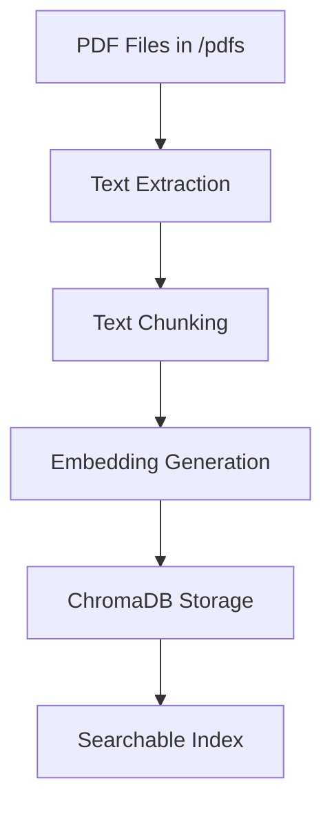

# PDF Embedding Processing Documentation

## Overview

The askIIIT system provides a sophisticated document processing pipeline that converts PDF documents into searchable vector embeddings. This enables semantic search and intelligent Q&A capabilities across your document collection.

## System Architecture

### Core Components

1. **Document Processor** (`document_processor.py`) - Handles text extraction, chunking, and embedding generation
2. **Bulk Processor** (`bulk_process.py`) - Orchestrates batch processing of multiple PDFs
3. **Configuration Utility** (`config_parallel.py`) - Optimizes settings based on system capabilities
4. **Memory Optimization** - Built-in memory management for large document collections

### Technology Stack

- **Embedding Model**: Qwen/Qwen3-Embedding-0.6B (384-dimensional vectors)
- **Vector Database**: ChromaDB with persistent storage
- **Text Processing**: pdfplumber for PDF extraction, spaCy for tokenization
- **Parallel Processing**: ThreadPoolExecutor with memory-safe concurrency
- **GPU Acceleration**: CUDA/MPS support with automatic fallback to CPU

## Processing Workflow

### 1. Document Processing Pipeline



#### Step 1: Text Extraction
- Uses `pdfplumber` for robust PDF text extraction
- Handles multi-page documents with memory optimization
- Processes pages sequentially to avoid memory overload
- Supports error recovery for corrupted pages

#### Step 2: Text Chunking
- **Smart Chunking**: Uses spaCy for sentence-aware chunking
- **Configurable Sizes**: Default 400 words per chunk with 50-word overlap
- **Semantic Boundaries**: Preserves sentence integrity where possible
- **Fallback Mechanism**: Basic word-splitting if spaCy unavailable

#### Step 3: Embedding Generation
- **Parallel Processing**: Multiple worker threads for concurrent embedding generation
- **Batch Processing**: Configurable batch sizes for memory efficiency
- **Device Optimization**: Automatic GPU/CPU selection based on available resources
- **Memory Safety**: Built-in OOM recovery and memory cleanup

#### Step 4: Vector Storage
- **ChromaDB Collections**: Separate collections for documents and chunks
- **Metadata Enrichment**: Automatic categorization and metadata generation
- **Deduplication**: Skips already processed documents
- **Batch Storage**: Processes chunks in batches to prevent memory buildup

### 2. Memory Optimization Strategy

The system implements several memory optimization techniques:

#### Automatic Resource Detection
```bash
# Check your system capabilities
python backend/config_parallel.py --info
```

#### Memory-Safe Processing
- **File Size Limits**: Default 25MB per PDF (configurable)
- **Sequential Processing**: One document at a time to avoid memory spikes
- **Garbage Collection**: Explicit memory cleanup after each document
- **GPU Cache Management**: Automatic CUDA/MPS cache clearing

#### Configurable Parameters
```env
# Memory Optimization Settings
MAX_FILE_SIZE_MB=25                    # Skip files larger than this
CHUNK_SIZE=400                         # Words per chunk
CHUNK_OVERLAP=50                       # Overlap between chunks
CHUNK_PROCESSING_BATCH_SIZE=20         # Chunks processed per batch

# Parallel Processing Settings
FORCE_CPU_EMBEDDINGS=false            # Force CPU usage
EMBEDDING_MAX_WORKERS=4               # Number of parallel workers
EMBEDDING_BATCH_SIZE=4                # Texts processed per batch
```

## Setup and Configuration

### 1. Environment Setup

First, configure your system for optimal performance:

```bash
# Generate recommended settings for your system
cd /home/avilol/Downloads/GitHub/askIIIT
python backend/config_parallel.py --generate

# This creates .env.recommended with optimized settings
# Copy relevant settings to your .env file
```

### 2. Required Environment Variables

Add these to your `.env` file:

```env
# ChromaDB Configuration
CHROMA_PERSIST_DIRECTORY=./chroma_data

# Embedding Model Settings
EMBEDDING_MODEL=Qwen/Qwen3-Embedding-0.6B
EMBEDDING_DEVICE=auto
EMBEDDING_TRUST_REMOTE_CODE=true

# Processing Configuration (adjust based on your system)
FORCE_CPU_EMBEDDINGS=false
EMBEDDING_MAX_WORKERS=4
EMBEDDING_BATCH_SIZE=4
CHUNK_SIZE=400
CHUNK_OVERLAP=50
MAX_FILE_SIZE_MB=25
```

### 3. System Requirements

#### Minimum Requirements
- **RAM**: 8GB
- **Storage**: 5GB free space
- **Python**: 3.8+

#### Recommended Requirements
- **RAM**: 16GB+
- **GPU**: 8GB+ VRAM (optional, improves speed)
- **Storage**: 10GB+ free space
- **CPU**: 4+ cores

#### GPU Support
- **NVIDIA**: CUDA 11.0+
- **Apple Silicon**: MPS support
- **Automatic Fallback**: CPU processing if GPU unavailable

## Usage Instructions

### 1. Bulk Processing of PDFs

Process all PDFs in the `/pdfs` directory:

```bash
# Check current document status
python backend/bulk_process.py --check

# Process all PDFs with automatic optimization
python backend/bulk_process.py --process

# Reset collections if needed (clears all data)
python backend/bulk_process.py --reset
```

### 2. Processing Individual Documents

```python
from document_processor import DocumentProcessor

# Initialize processor with auto-detection
processor = DocumentProcessor()

# Process a single PDF
with open("document.pdf", "rb") as f:
    file_content = f.read()

result = processor.process_document(
    file_content=file_content,
    filename="document.pdf",
    doc_id="unique-id",
    category="academics",
    description="Academic policies and procedures",
    author="admin",
    documents_collection=documents_collection,
    chunks_collection=chunks_collection
)

print(f"Created {result['chunk_count']} chunks")
```

### 3. System Optimization

#### Check Your Settings
```bash
# Validate current configuration
python backend/config_parallel.py --validate

# Get system information and recommendations
python backend/config_parallel.py --info
```

#### Performance Tuning

Based on your system, adjust these settings:

**High-Memory System (16GB+ RAM)**:
```env
EMBEDDING_MAX_WORKERS=6
EMBEDDING_BATCH_SIZE=8
CHUNK_PROCESSING_BATCH_SIZE=50
MAX_FILE_SIZE_MB=50
```

**GPU System (8GB+ VRAM)**:
```env
FORCE_CPU_EMBEDDINGS=false
EMBEDDING_MAX_WORKERS=4
EMBEDDING_BATCH_SIZE=2
```

**Limited Memory System (8GB RAM)**:
```env
EMBEDDING_MAX_WORKERS=2
EMBEDDING_BATCH_SIZE=4
CHUNK_PROCESSING_BATCH_SIZE=10
MAX_FILE_SIZE_MB=10
```

## Monitoring and Troubleshooting

### 1. Processing Status

The system provides real-time feedback during processing:

```
🖥️  System Information:
   CPU Cores: 8
   Memory: 16.0 GB
   CUDA Available: True
   GPU Memory: 24.0 GB

⚡ Recommended Settings:
   Device: cuda
   Max Workers: 4
   Batch Size: 2

📊 Processing Progress:
Processing 5/20: document.pdf (12.3 MB)
✓ Processed document.pdf: 45 chunks created
```

### 2. Common Issues and Solutions

#### Out of Memory Errors
```bash
# Reduce batch sizes and workers
EMBEDDING_MAX_WORKERS=1
EMBEDDING_BATCH_SIZE=1
CHUNK_PROCESSING_BATCH_SIZE=5
```

#### GPU Memory Issues
```bash
# Force CPU processing
FORCE_CPU_EMBEDDINGS=true
```

#### Large File Issues
```bash
# Reduce file size limit
MAX_FILE_SIZE_MB=10
```

#### Dimension Mismatch Errors
```bash
# Reset ChromaDB collections
python backend/bulk_process.py --reset
```

### 3. Performance Metrics

Expected processing speeds (approximate):

| System Type | Speed (pages/minute) | Documents/hour |
|-------------|---------------------|----------------|
| GPU (24GB) | 200-300 | 15-25 |
| GPU (8GB) | 100-150 | 10-15 |
| CPU (16GB) | 50-100 | 5-10 |
| CPU (8GB) | 25-50 | 3-8 |

## API Reference

### DocumentProcessor Class

#### Initialization
```python
processor = DocumentProcessor(
    embedding_model_name="Qwen/Qwen3-Embedding-0.6B",  # Model to use
    max_workers=4,                                      # Parallel workers
    memory_config=None,                                 # Auto-detect
    force_cpu=False                                     # GPU preference
)
```

#### Key Methods

**process_document()**
```python
result = processor.process_document(
    file_content: bytes,           # PDF file content
    filename: str,                 # Original filename
    doc_id: str,                   # Unique document ID
    category: str,                 # Document category
    description: str,              # Document description
    author: str,                   # Author name
    documents_collection: Collection,  # ChromaDB collection
    chunks_collection: Collection      # ChromaDB collection
)
# Returns: {"chunk_count": int, "text_length": int}
```

**extract_text_from_pdf()**
```python
text = processor.extract_text_from_pdf(file_content: bytes)
# Returns: str (extracted text)
```

**chunk_text()**
```python
chunks = processor.chunk_text(
    text: str,
    chunk_size: int = 400,        # Words per chunk
    overlap: int = 50             # Overlap words
)
# Returns: List[str] (text chunks)
```

**generate_embeddings()**
```python
embeddings = processor.generate_embeddings(texts: List[str])
# Returns: List[List[float]] (384-dim vectors)
```

### Bulk Processing Functions

**process_existing_pdfs()**
```python
await process_existing_pdfs()
# Processes all PDFs in /pdfs directory
```

**check_existing_documents()**
```python
check_existing_documents()
# Shows current ChromaDB status
```

**reset_collections()**
```python
reset_collections()
# Clears and recreates ChromaDB collections
```

## File Structure

```
backend/
├── bulk_process.py           # Main bulk processing script
├── document_processor.py     # Core document processing logic
├── config_parallel.py       # System optimization utility
├── processing_status.py     # Processing progress tracking
├── requirements.txt         # Python dependencies
└── .env                     # Configuration file

pdfs/                        # Source PDF directory
├── document1.pdf
├── document2.pdf
└── ...

chroma_data/                 # ChromaDB storage
├── chroma.sqlite3
└── collections/
```

## Security and Privacy

### Data Handling
- **Local Processing**: All documents processed locally, no external API calls
- **Secure Storage**: ChromaDB data stored locally in encrypted format
- **Memory Safety**: Sensitive content cleared from memory after processing
- **Access Control**: Admin-only document upload and processing

### Model Security
- **Trusted Models**: Uses verified Qwen3 embedding model
- **Local Inference**: No data sent to external services
- **Model Validation**: Automatic integrity checks

## Best Practices

### 1. Document Preparation
- **Organize PDFs**: Place all documents in the `/pdfs` directory
- **File Naming**: Use descriptive, unique filenames
- **File Size**: Keep individual files under 25MB for optimal processing
- **File Quality**: Ensure PDFs contain extractable text (not just images)

### 2. System Optimization
- **Regular Monitoring**: Check system resources during processing
- **Batch Processing**: Process documents in smaller batches during off-peak hours
- **Storage Management**: Regularly backup ChromaDB data
- **Performance Tuning**: Adjust settings based on your specific hardware

### 3. Maintenance
- **Regular Updates**: Keep embedding model and dependencies updated
- **Index Optimization**: Periodically rebuild ChromaDB index for better performance
- **Log Monitoring**: Review processing logs for errors or warnings
- **Backup Strategy**: Implement regular backups of processed embeddings

## Troubleshooting Guide

### Common Error Messages

**"GPU OOM in worker, falling back to CPU"**
- Reduce `EMBEDDING_BATCH_SIZE`
- Reduce `EMBEDDING_MAX_WORKERS`
- Enable `FORCE_CPU_EMBEDDINGS=true`

**"File too large to fit in memory"**
- Reduce `MAX_FILE_SIZE_MB`
- Increase system RAM
- Process files individually

**"Dimension mismatch in ChromaDB"**
- Run `python backend/bulk_process.py --reset`
- Check embedding model consistency

**"No text content found in document"**
- Ensure PDF contains extractable text
- Check if PDF is image-based (requires OCR)
- Verify PDF file integrity

### Performance Issues

**Slow Processing Speed**
1. Check system resources with `config_parallel.py --info`
2. Optimize worker and batch size settings
3. Enable GPU processing if available
4. Process smaller batches

**High Memory Usage**
1. Reduce batch sizes and worker counts
2. Enable memory optimization settings
3. Process documents sequentially
4. Clear ChromaDB cache periodically

**GPU Not Being Used**
1. Check CUDA/MPS availability
2. Verify GPU memory requirements
3. Update GPU drivers
4. Check `FORCE_CPU_EMBEDDINGS` setting

---

For additional support, check the system logs and refer to the individual module documentation in the source code comments.
